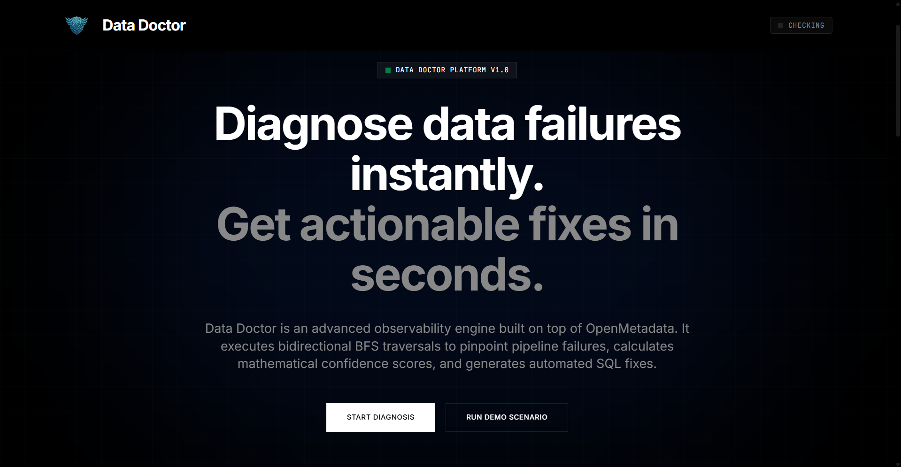
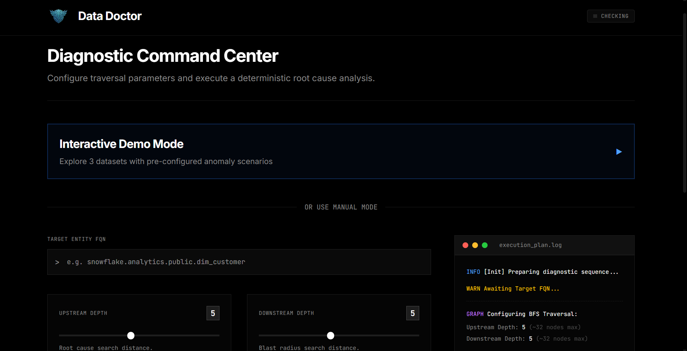
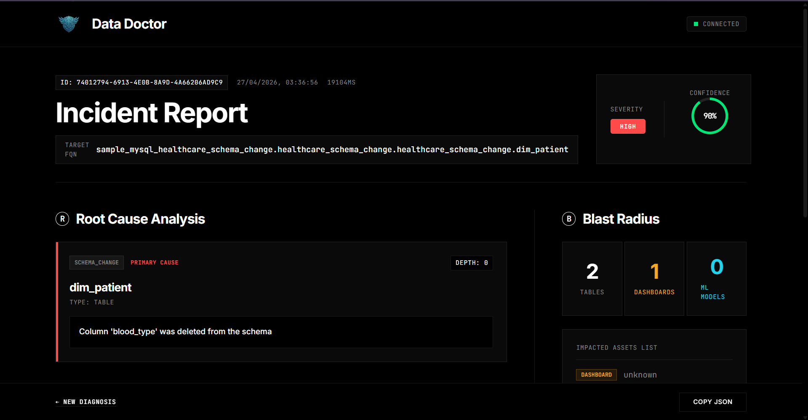
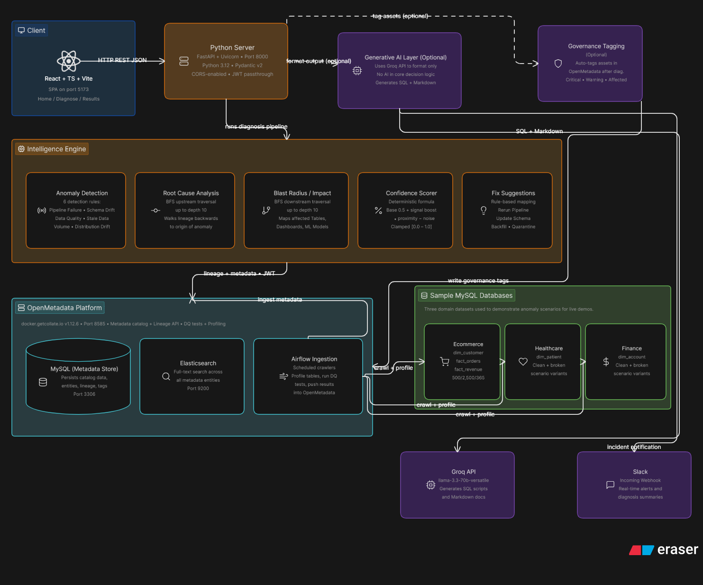

# Data Doctor

> **Intelligent Root Cause Analysis for Data Pipelines**  
> Automatically detect anomalies, traverse lineage graphs, and generate actionable fixes — all in under 3 seconds.

[](https://open-metadata.org/)
[](https://www.python.org/)
[](https://reactjs.org/)
[](LICENSE)

[Watch Demo Video](https://youtu.be/KNUAE1Yt_Fg) | [Documentation](./docs/) | [Quick Start](#quick-start-5-minutes)

---

## The Problem

Data pipeline failures cost companies **millions in lost revenue and productivity**. When pipelines break, data teams spend **hours manually investigating**:

- Which upstream table caused the failure?
- How many downstream assets are affected?
- What's the fix, and how confident are we?

**Existing solutions** either lack transparency (AI black boxes) or require manual investigation (time-consuming).

---

## The Solution

**Data Doctor** is an intelligent diagnostic system built on OpenMetadata that:

1. **Detects 6 types of anomalies** using production-grade detection rules
2. **Performs bidirectional graph traversal** to find root causes via lineage
3. **Calculates mathematical confidence scores** (transparent, explainable)
4. **Computes blast radius** to assess downstream impact
5. **Generates actionable fixes** with optional AI enhancement
6. **Applies governance tags** to mark unreliable assets

**Project Documentation:**
- **[Research Document](./docs/research.docx)** - Research conducted before creating the project, including problem analysis and existing solutions evaluation
- **[Decision Document](./docs/decision.docx)** - Key architectural decisions we made during the design phase
- **[Specifications Document](./docs/specs.docx)** - Initial functional requirements document outlining the system specifications

### Screenshots

<table>
  <tr>
    <td><br/><b>Home Page</b></td>
    <td><br/><b>Interactive Demo</b></td>
  </tr>
  <tr>
    <td colspan="2"><br/><b>Root Cause Analysis Results</b></td>
  </tr>
</table>

---

## Architecture

<div align="center">
  
</div>

---

## Key Features

### **6 Production-Grade Anomaly Detectors**

| Detector | Type | Signal Strength | Detection Method |
|----------|------|-----------------|------------------|
| **Pipeline Failure** | Operational | HIGH | `taskStatus.executionStatus == 'Failed'` |
| **Schema Drift** | Structural | HIGH | `changeDescription.fieldsDeleted` exists |
| **Data Quality Failure** | Test-based | MEDIUM | `testCaseResult.testCaseStatus == 'Failed'` |
| **Stale Data** | Freshness | MEDIUM | `profile.timestamp < SLA_threshold` |
| **Volume Anomaly** | Statistical | HIGH | `abs(current - mean) > 2σ` |
| **Distribution Drift** | Statistical | MEDIUM | `nullProportion change > 15%` |

### **Bidirectional Graph Traversal**

- **Upstream BFS**: Find root causes by traversing lineage backwards
- **Downstream BFS**: Calculate blast radius by traversing lineage forwards
- **Configurable depth**: Default 5 hops, max 10 hops
- **Edge-aware**: Checks both nodes (tables) and edges (pipelines)

### **Mathematical Confidence Scoring**

```python
confidence = BASE_SCORE (0.5)
           + TYPE_MODIFIER (0.3 for high-signal, 0.1 for low-signal)
           + DISTANCE_MODIFIER (0.2 if depth ≤ 1)
           - NOISE_PENALTY (0.1 × num_contributing_factors)
# Clamped to [0.0, 1.0]
```

**Transparent, explainable, no AI black box.**

### **Hybrid AI Enhancement**

- **Core detection**: Deterministic, rule-based (transparent)
- **AI-powered suggestions**: Groq LLM generates actionable fixes, SQL scripts, and detailed reports
- **Groq LLM**: Generates SQL scripts, Markdown reports, and Slack notifications
- **Slack integration**: Final diagnostic reports are automatically sent to users via Slack with severity-colored alerts
- **Graceful degradation**: Falls back to base suggestions if AI fails

### **Automatic Governance Tagging**

| Severity | Tag Applied |
|----------|-------------|
| HIGH | `DataQuality.Critical` |
| MEDIUM | `DataQuality.Warning` |
| LOW | `DataQuality.UnderInvestigation` |
| Root Cause | `DataQuality.RootCause` |
| Impacted Assets | `DataQuality.Affected` |

### **Interactive Demo System**

**24 Pre-configured Scenarios** (3 datasets × 8 scenarios):

- **Datasets**: E-commerce, Healthcare, Finance
- **Scenarios**: clean, schema_change, data_quality, volume_anomaly, distribution_drift, stale_data, pipeline_failure, multiple
- **Instant switching**: No script execution required
- **Real data**: 263,460 rows across all scenarios

---

## Deep OpenMetadata Integration

Data Doctor leverages **8+ OpenMetadata features**:

1. **Lineage API** - Bidirectional graph traversal (upstream/downstream)
2. **Data Quality Tests** - Test case status for DATA_QUALITY_FAILURE detection
3. **Profile Data** - Timestamps, row counts for STALE_DATA and VOLUME_ANOMALY
4. **Version History** - Historical profiles for trend analysis
5. **Governance Tags** - Automatic tagging of unreliable assets
6. **Entity Search** - Fast entity lookup by FQN
7. **Pipeline Status** - Task execution status for PIPELINE_FAILURE
8. **Change Descriptions** - Schema evolution tracking for SCHEMA_DRIFT

**For detailed information on what OpenMetadata features we used and for what purpose, check out the [OpenMetadata Usage Guide](./docs/openmetadata-usage.docx).**

---

## Quick Start (5 Minutes)

**Additional Setup Guides:**
- **[Custom Mode Setup](./docs/custom-mode.docx)** - Detailed guide for connecting to your own OpenMetadata instance with custom credentials
- **[Running Demo Guide](./docs/running-demo.docx)** - Step-by-step instructions for running the interactive demo with all scenarios

### Prerequisites

- Docker Desktop (running)
- Python 3.12+ with `uv` ([install guide](https://docs.astral.sh/uv/getting-started/installation/))
- Node.js 18+ with npm

### 1. Start OpenMetadata

```bash
cd openmetadata-docker
docker compose -f docker-compose.yml up -d

# Wait 3-5 minutes for health check
docker ps  # Check for "(healthy)" status
```

### 2. Start Demo Databases (Healthcare)

```bash
# Start 8 healthcare scenario databases
docker compose -f docker-compose.yml -f docker-compose.healthcare-scenarios.yml up -d
```

### 3. Setup Scenarios in OpenMetadata

```bash
cd ../backend

# Setup healthcare scenarios (10-15 minutes)
uv run python scripts/setup_healthcare_scenarios.py
```

### 4. Start Backend

```bash
# Configure environment
cp .env.example .env
# Edit .env and add your OPENMETADATA_JWT_TOKEN

# Start FastAPI server
uv run python -m uvicorn src.main:app --reload
```

### 5. Start Frontend

```bash
cd ../frontend
npm install
npm run dev
```

### 6. Open Browser

Navigate to **http://localhost:5173** and start diagnosing!

---

## Usage

### Interactive Demo Mode

1. Click **"Try Interactive Demo"** on the home page
2. Select a **dataset** (e.g., Healthcare)
3. Select a **scenario** (e.g., schema_change)
4. Click **"Diagnose"**
5. View **root cause analysis** in under 3 seconds

### Manual FQN Mode

1. Enter a **Fully Qualified Name** (e.g., `sample_mysql_healthcare_clean.healthcare_clean.healthcare_clean.dim_patient`)
2. Optionally enable **AI enhancement** and **governance tagging**
3. Click **"Diagnose"**
4. View detailed **incident report**

### Multi-Tenant Mode

Provide your own OpenMetadata credentials:
- **Host Port**: `https://your-openmetadata.com/api`
- **JWT Token**: Your authentication token

---

## Testing

```bash
cd backend

# Run all tests
uv run pytest

# Run with coverage
uv run pytest --cov=src --cov-report=html

# Run specific test file
uv run pytest tests/api/test_diagnosis.py -v
```

**Test Coverage:**
- Unit tests for all core modules
- Integration tests for API endpoints
- Async test support with pytest-asyncio

---

## Performance Metrics

| Metric | Value |
|--------|-------|
| **Execution Time (without AI)** | 1-3 seconds |
| **Execution Time (with AI)** | 2-5 seconds |
| **BFS Complexity** | O(V + E) |
| **Max Graph Depth** | 10 hops (configurable) |
| **Demo Data Volume** | 263,460 rows across 24 databases |

---

## Project Structure

```
data-doctor/
├── backend/                    # FastAPI backend
│   ├── src/
│   │   ├── api/               # API endpoints
│   │   │   └── v1/
│   │   │       ├── diagnosis.py    # Main diagnosis endpoint
│   │   │       ├── demo.py         # Interactive demo endpoints
│   │   │       └── health.py       # Health check
│   │   ├── core/              # Core business logic
│   │   │   ├── detection.py        # 6 anomaly detectors
│   │   │   ├── root_cause.py       # BFS graph traversal
│   │   │   ├── confidence.py       # Confidence scoring
│   │   │   ├── impact.py           # Blast radius calculation
│   │   │   ├── suggestions.py      # Fix generation
│   │   │   ├── ai_layer.py         # AI enhancement (Groq)
│   │   │   ├── governance.py       # Governance tagging
│   │   │   ├── lineage.py          # Lineage utilities
│   │   │   └── api_client.py       # OpenMetadata client
│   │   ├── config.py          # Configuration
│   │   ├── schemas.py         # Pydantic models
│   │   └── main.py            # FastAPI app
│   ├── scripts/               # Setup scripts
│   │   ├── setup_all_scenarios.py
│   │   ├── setup_healthcare_scenarios.py
│   │   ├── setup_ecommerce_scenarios.py
│   │   └── setup_finance_scenarios.py
│   ├── tests/                 # Pytest tests
│   └── pyproject.toml         # Python dependencies
├── frontend/                  # React frontend
│   ├── src/
│   │   ├── pages/
│   │   │   ├── Home.tsx       # Landing page
│   │   │   ├── Diagnose.tsx   # Diagnosis form + demo
│   │   │   └── Results.tsx    # Root cause analysis results
│   │   ├── components/
│   │   │   ├── AnomalyCard.tsx
│   │   │   ├── BlastRadius.tsx
│   │   │   ├── ConfidenceGauge.tsx
│   │   │   └── FixCard.tsx
│   │   ├── api.ts             # API client
│   │   └── types.ts           # TypeScript types
│   ├── public/                # Static assets
│   │   ├── logo.png
│   │   ├── home-page.png
│   │   ├── diagnose-form.png
│   │   └── results-page.png
│   └── package.json           # Node dependencies
├── openmetadata-docker/       # Docker setup
│   ├── docker-compose.yml     # Base OpenMetadata stack
│   ├── docker-compose.scenarios.yml  # All 24 databases
│   └── sample-data/           # SQL init files
│       ├── healthcare-init.sql
│       ├── ecommerce-init.sql
│       └── finance-init.sql
├── docs/                      # Additional documentation
│   ├── decision.docx
│   ├── openmetadata-usage.docx
│   ├── research.docx
│   └── specs.docx
├── DEMO_GUIDE.md              # 10-minute demo script
├── DEMO_QUICK_REFERENCE.md    # Quick reference card
└── README.md                  # This file
```

---

## Technology Stack

### Backend
- **Framework**: FastAPI 0.136.1+ (async)
- **OpenMetadata SDK**: v1.12.6.2
- **AI**: Groq API (llama-3.3-70b-versatile)
- **Validation**: Pydantic 2.11.10+
- **Testing**: pytest 9.0.3+
- **Package Manager**: uv

### Frontend
- **Framework**: React 19.2.5 + TypeScript 6.0.2
- **Build Tool**: Vite 8.0.10
- **Routing**: React Router DOM 7.14.2
- **Styling**: Tailwind CSS 4.2.4

### Infrastructure
- **OpenMetadata**: v1.12.6 (Docker)
- **MySQL**: 8.0+ (24 demo databases)
- **Elasticsearch**: 9.3.0

---

## Advanced Features

### Multi-Tenant Support

Connect to your own OpenMetadata instance:

```json
{
  "target_fqn": "your.table.fqn",
  "openmetadata_host_port": "https://your-om.com/api",
  "openmetadata_jwt_token": "your_jwt_token"
}
```

### AI-Enhanced Suggestions

Enable AI enhancement for:
- **SQL Scripts**: Executable fix scripts with safety constraints
- **Markdown Reports**: Professional incident reports
- **Slack Messages**: Severity-colored alerts with Block Kit

### Governance Automation

Automatically tag unreliable assets:
- **Critical**: High-severity anomalies
- **Warning**: Medium-severity anomalies
- **Under Investigation**: Low-severity anomalies
- **Root Cause**: Primary root cause entity
- **Affected**: All downstream impacted assets

---

## License

Apache License 2.0 - see [LICENSE](LICENSE) file for details.
